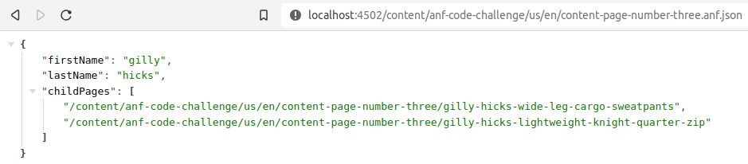

# Abercrombie AEM Developer Skill Assessment

## Solution Notes - Sarthak Kakkar

All exercises have been completed, I have tried my best to not cut corners as suggested.

Attached below are screenshots for each, with some documentation explaining the solution designed.

For ease of review I've created a PR as well, in the public repo, would appreciate feedback through comments as well.

## Pre Steps

- Created a service user through sling [reponit](ui.apps/src/main/content/jcr_root/apps/anf-code-challenge/config/org.apache.sling.jcr.repoinit.RepositoryInitializer~anf.config) and [amended](ui.apps/src/main/content/jcr_root/apps/anf-code-challenge/config/org.apache.sling.serviceusermapping.impl.ServiceUserMapperImpl.amended-anf.cfg.json) the service user mapping.
- Updated the [dispatcher](dispatcher/src/conf.dispatcher.d/filters/ams_publish_filters.any) config for a path based servlet for exercise 3. 
- Had to update some files for the archetype, for JUnits & FE build.

## Exercise 1

Created a Sling [job producer](core/src/main/java/com/anf/core/schedulers/ProcessedJobProducer.java)-[consumer](core/src/main/java/com/anf/core/schedulers/ProcessedJobConsumer.java), for the job to persist server restarts which is scheduled and runs, on author, every 2 mins (default config).
[Test cases](core/src/test/java/com/anf/core/schedulers)

## Exercise 2

Created a resource type based [servlet](core/src/main/java/com/anf/core/servlets/SearchServlet.java) which is triggered via `/content/page.anf.json|xml`

[Test case](core/src/test/java/com/anf/core/servlets/SearchServletTest.java)

## Exercise 3

Created a [new component](ui.apps/src/main/content/jcr_root/apps/anf-code-challenge/components/anfform) with [js](ui.frontend/src/main/webpack/components/_anfform.js) & [css](ui.frontend/src/main/webpack/components/_anfform.scss), which uses a [servlet](core/src/main/java/com/anf/core/servlets/FulltextSearchServlet.java) to search.
I've placed the component on a [page](ui.content/src/main/content/jcr_root/content/anf-code-challenge/us/en/search/.content.xml) here with authored values.

[Test case](core/src/test/java/com/anf/core/servlets/FulltextSearchServletTest.java)
